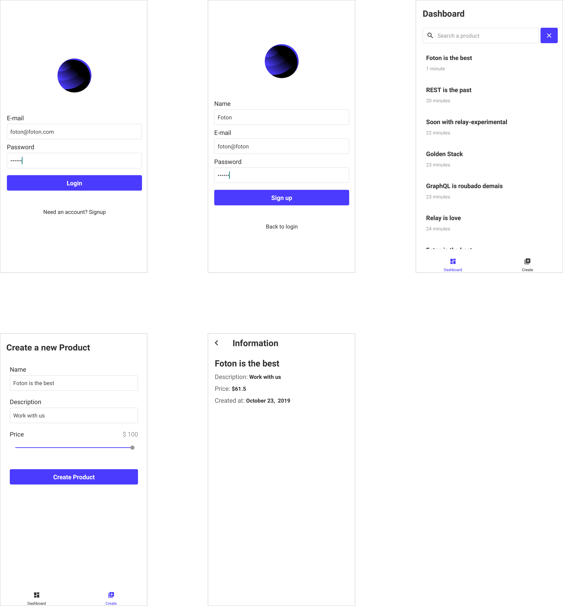

# Foton Challenge mobile

This app is the mobile version of the [Foton challenge](https://github.com/FotonTech/join). Built with react native and relay, it's use the newest in mobile technology.



## Getting Started

Choose a folder to save the project and clone the repository:

```sh
git clone https://github.com/jean-leonco/Foton-mobile
```

### Prerequisites

Ensure you have the following resources to use properly:

- [Foton api](https://github.com/jean-leonco/Foton-mono)
- Yarn or npm
- React Native cli
- Android SDK
- Android device

> You can use an Android physical or virtual device. Check [React Native getting started](https://facebook.github.io/react-native/docs/0.60/getting-started), for device configuration

### Installing

Access the project folder in your terminal and run `yarn` or `npm install`.

### Configuration

If you are running on physical device attached to usb port or virtual device, It's necessary to:

```sh
adb reverse tcp:5000 tcp:5000
```

The command will redirect request made on device's 5000 port to your machine 5000 port.

### Running

First, install the app. In the terminal, run:

```sh
yarn android
```

Sometimes, react-native does not open metro bundler terminal. In this case, run:

```bash
yarn start
```

> If after these steps, all you can see is a white screen, reopen the app.
